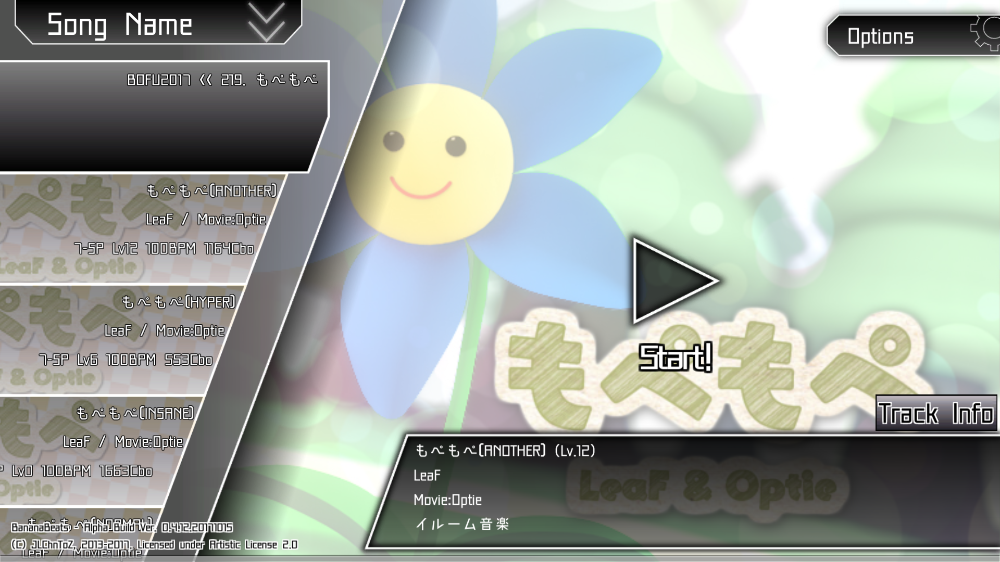
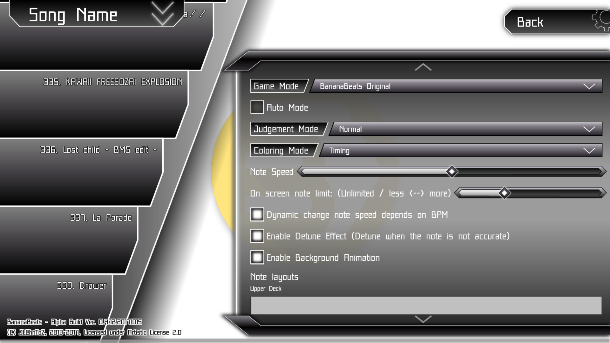
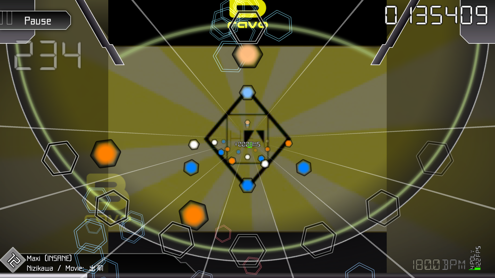
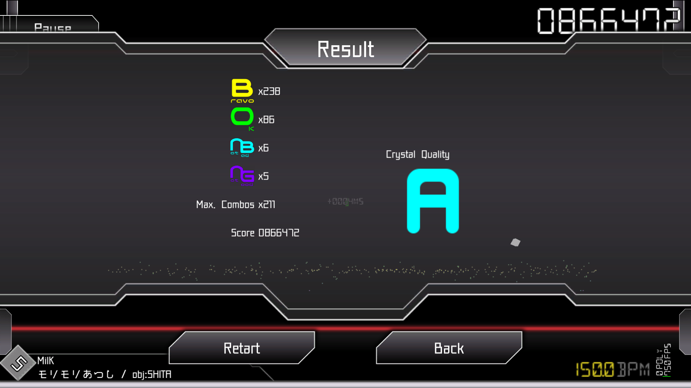
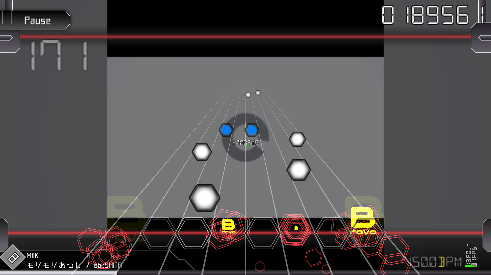

# BananaBeats
(Formly named: Be-Music-Player Unity Edition)

**Yet-Another Unity-based [Be-Music Script/Source](https://en.wikipedia.org/wiki/Be-Music_Source) (BMS) Player**

This project aims to parse BMS scores and allows everyone to play with them as a rhythm game. You may play with your BMS track with keyboard, game controllers or even with touch screen.

There was a program with the same name that I have made in 2013 (I did not publish that LOL), but it was quite messy and does not parse the BMS map correctly, so this is the successor of that experimental program even almost everything has been rewritten and that old stuff was not Unity-based but XNA-based.

Currently this project is still in alpha stage, therefore the features are still incomplete.

## Currently Supported BMS Features

- Channel 10-29 (Normal playable tracks)
- Channel 50-69 (Long hold note tracks)
- BPM / Measure Beat changes
- WAV / OGG Sound Effect / BGM
- Static frame BGAs
- Video file BGAs (Via VideoStreamer / FFMPEG)
- [Bmson format](https://bmson.nekokan.dyndns.info/)

## Pending features

- **Online ranking**: It is not critical but players will be happy to compare the result online each other.

## How to Play

- Put all your BMS tracks and the resource files into the BMS folder, it is OK to make sub-folders in it.
- Launch the game. Before you start, you can change the key mappings in the second tab.
- Select the song you want to play.
- You may adjust the note speed by dragging the slider on the top of the screen.
- The sorting options will be actived once all playable tracks loaded.
- If you just want to view or listen to the track, you can toggle the "Auto" checkbox.
- Click the "Start" button at the bottom of the screen.
- Enjoy your game!

## Contributing

Feel free to clone, contribute, give suggestions and/or send pull requests!
Currently the whole stuff is lack of graphics and some of the features are missing, it would be great if anyone can help!

## Copyright Notice / Acknowledgements

This application uses following products:
- **[Makinas Font（マキナス）](http://moji-waku.com/makinas/)** by [もじワク研究](http://moji-waku.com) - [LICENSE](http://moji-waku.com/mj_work_license/)
- **[5 Identification Mono Font](http://www.dafont.com/5identification-mono.font)** by [Winter Design Studio](http://www.dafont.com/winty5.d4560)
- **[DSEG Font Family](https://github.com/keshikan/DSEG)** by [keshikan](http://www.keshikan.net) - [LICENSE](https://github.com/keshikan/DSEG/blob/master/DSEG-LICENSE.txt)
- **[VideoStreamer & VideoStreamer.NET](http://fr.sfml-dev.org/forums/index.php?topic=12305.0)** by Brown Star - [LICENSE](https://bitbucket.org/zsbzsb/videostreamer/src/df763ea34e6e8be6576dea3fb7843a7e1c193dda/license.txt)
- **[Unity UI Extensions](https://bitbucket.org/ddreaper/unity-ui-extensions)** - [LICENSE](https://bitbucket.org/ddreaper/unity-ui-extensions/src/13e291bef4ff636f49f34b4a949cc0fc7d8edd9d/LICENSE)
- **[Un4seen BASS](http://www.un4seen.com/bass.html)** - [LICENSE](http://www.un4seen.com/bass.html#license) (*)
- **[ManagedBass.PInvoke](https://github.com/ManagedBass/ManagedBass.PInvoke)**
- **[Ude C# Port](https://github.com/errepi/ude)**

Except the components mentioned above, the whole application (or game) in open-sourced under [Artistic License 2.0](LICENSE).

(*) Commercial license of BASS is **NOT** included or covered in any official binaries or sources of BananaBeats (Indeed, BananaBeats is not a commercial project), for any commercial usage of BananaBeats with BASS (For example, selling it) have to purchase the license individually.

## Special Thanks

- UI Design: CxB
- Japanese Translation: 千

## Snapshots

Also here has a auto-play live demostration (external link):

## References

- **[BMS command memo](http://hitkey.nekokan.dyndns.info/cmds.htm)**: Even this is a draft memo, it is deep enough to study the whole BMS format.
- **[Bmson Format Specification](https://bmson-spec.readthedocs.io/en/master/doc/)**
